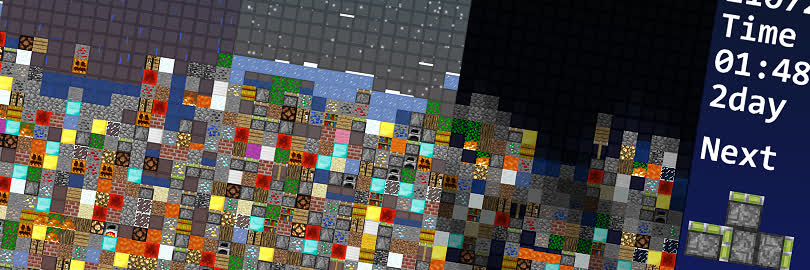

# CreateInChaos 失序重构
一款由 **Unity** 制作的游戏，融合了**俄罗斯方块**和**我的世界**的元素。

使用版本: [Unity 2020.3.28f1 (LTS)](https://unity.cn/release-notes/lts/2020/2020.3.28f1)

游戏下载: https://hdms.itch.io/create-in-chaos

游戏介绍: https://www.bilibili.com/video/BV1xm4y1w7QN

游戏交流群(QQ): 781213303
***
因为 bgm 占了近90%的空间，因为影响不大就不带 bgm 文件了。

以 `.unitypackage` 文件对比，带bgm有8.5M，无bgm仅1M。
